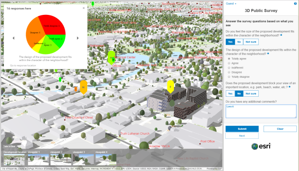

# 3D public-survey

3D Public Survey is a configurable JavaScript application designed to engage with the community in a 3D scene and solicit structured feedback on for example proposed property developments.

This application includes data management tools designed to publish pre-authored survey questions.

* Try the [3D Public Survey (Local Government) application](http://links.esri.com/localgovernment/tryit/3DPublicSurvey/)

## Features

* Conduct focused 3D public surveys (for example: ask structured questions to the public about a new proposed development in the community)

## Requirements

**Start now using Esri-supplied sample services and maps**

You can start using the application now by setting it up on a web server and using sample services supplied by Esri.

**Start now using your own services and maps**

For more information on requirements and publication steps, see [3D Public Survey for Local Government](http://links.esri.com/localgovernment/help/3DPublicSurvey/) help.

## Resources

Learn more about Esri's ArcGIS for [Local Government](http://solutions.arcgis.com/local-government/) and [State Government](http://solutions.arcgis.com/state-government/) maps and apps.

* Show me a [list] (http://esri.github.io/#Local-Government) of other Local Government GitHub repositories.
* Show me a [list] (http://esri.github.io/#State-Government) of other State Government GitHub repositories.

##Changing Your Configuration

You can change the configuration of the 3DPublic-survey app in the configuration.json.

## Issues

Find a bug or want to request a new feature?  Please let us know by submitting an issue.

## Contributing

Esri welcomes contributions from anyone and everyone.
Please see our [guidelines for contributing](https://github.com/esri/contributing).

## Licensing

Copyright 2015 Esri

Licensed under the Apache License, Version 2.0 (the "License");
you may not use this file except in compliance with the License.
You may obtain a copy of the License at

   http://www.apache.org/licenses/LICENSE-2.0

Unless required by applicable law or agreed to in writing, software
distributed under the License is distributed on an "AS IS" BASIS,
WITHOUT WARRANTIES OR CONDITIONS OF ANY KIND, either express or implied.
See the License for the specific language governing permissions and
limitations under the License.

A copy of the license is available in the repository's
[LICENSE.txt](https://github.com/Esri/photo-survey/blob/master/License.txt) file.

